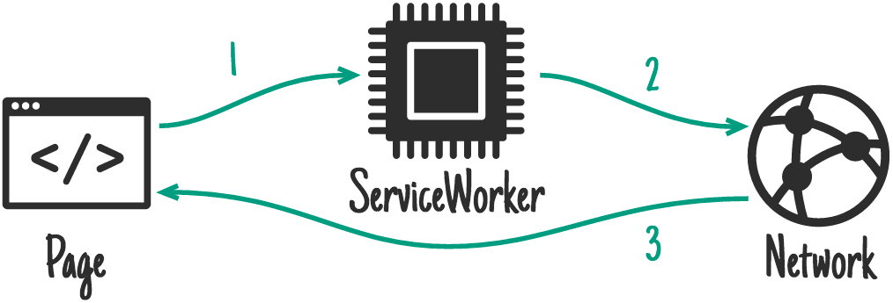
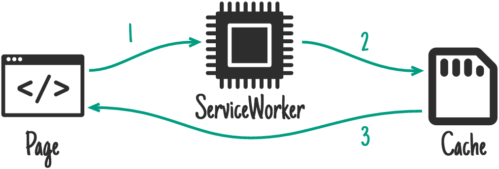
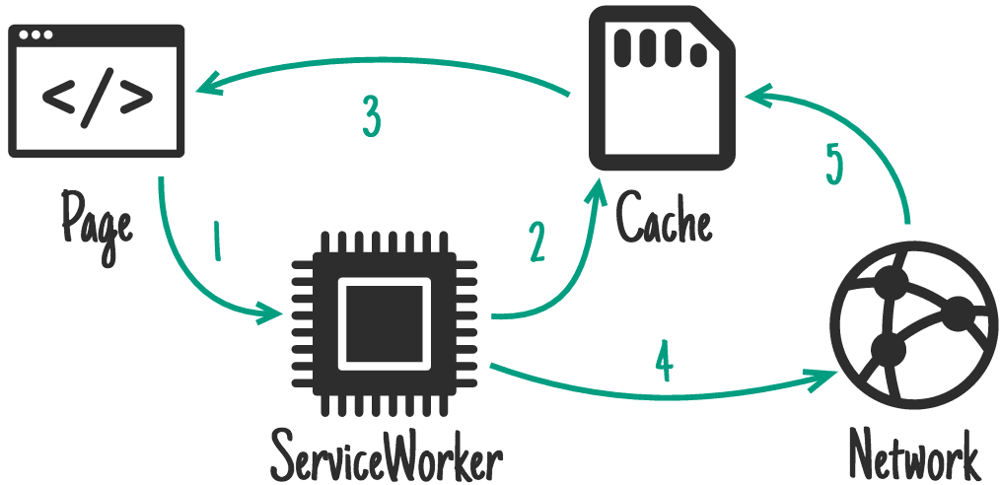

# keq-cache

[npm]: https://www.npmjs.com/package/keq-cache

[][npm]
[][npm]
[][npm]
[][npm]
[](https://codecov.io/gh/keq-request/keq-cache)

## Why Need This

[SW MDN]: https://developer.mozilla.org/en-US/docs/Web/API/Service_Worker_API

This is a simple alternative to [Service Worker][SW MDN] for projects that cannot enable [Service Worker][SW MDN]. No need to manually write cache code, just configure the cache strategy.

## Usage

<!-- prettier-ignore -->
```typescript
import { request } from "keq"
import { cache, Strategy } from "keq-cache"

request.use(cache())
```

By default, [NetworkOnly Strategy](#networkonly) and [Memory Storage](#memory) will be used for all request. And you can customize the global configuration:

<!-- prettier-ignore -->
```typescript
import { request } from "keq"
import { cache, Strategy } from "keq-cache"

request
  .use(
    cache({
      storage: Storage.MEMORY,
      rules: [
        {
          pattern: (ctx) => ctx.request.method === "get",
          strategy: Strategy.STALE_WHILE_REVALIDATE,
          ttl: 5 * 60 * 1000,
          key: (ctx) => ctx.request.__url__.href,
          onNetworkResponse: (response, cachedResponse) => {
            console.log('The network response: ', response)
            console.log('The response that cache hit: ', cachedResponse)
          }
        },
      ],
    })
  )
```

The above configuration, all GET request will use [StateWileRevalidate Strategy](#stale-while-revalidate) and cache will expire after 5 minutes.

It is natural to override the global configuration when sending a request:

<!-- prettier-ignore -->
```typescript
import { request } from "keq"
import { cache, Strategy, Eviction } from "keq-cache"

request
  .get("/example")
  .options({
    cache: {
      strategy: Strategy.NETWORK_FIRST,
      key: 'custom-cache-key',
      ttl: 1000,
    },
  })
```

## Configuration

| Name                    | Default                           | Description                                                                                                       |
| :---------------------- | :-------------------------------- | :---------------------------------------------------------------------------------------------------------------- |
| storage                 | [Storage.Memory](#memory)         | [See More](#storage)                                                                                              |
| maxStorageSize          | Infinity                          | Maximum storage space occupied by the cache. If exceeded, some cache will be removed according to the `Eviction`. |
| threshold               | `0.2 * maxStorageSize`            | If a request size is greater than threshold, it will not be cached. Don't be larger than `maxStorageSize`         |
| Eviction                | [VolatileTTL](#volatilettl)       | Eviction policies when memory is insufficient. [See More](#eviction)                                              |
| keyFactory              | `(context) => context.identifier` | The requested cache unique key factory. Requests with the same key will share the cache                           |
| rules.pattern           | -                                 |
| rules.key               | -                                 | The cache key factory for the request match the rule.                                                             |
| rules.strategy          | [NetworkFirst](#networkfirst)     | how generates a response after receiving a fetch. [See More](#strategies)                                         |
| rules.ttl               | `Infinity`                        | cache time to live                                                                                                |
| rules.onNetworkResponse | `undefined`                       | Callback invoke after network request finish.                                                                     |

## Storage

### `Storage.MEMORY`

Store the cache in memory and make it invalid after the page is refreshed.

### `Storage.INDEXED_DB`

Storing the cache in IndexedBD that avoid cache invalid after refresh pages.

## Strategies

### `Strategies.NETWORK_ONLY`



Send request directly. Don't use cache.

### `Strategies.NETWORK_FIRST`


Try to send the request, if it fails, return the cache.

### `Strategies.CACHE_FIRST`



Return cache if it exists, otherwise send request.

### `Strategies.STALE_WHILE_REVALIDATE`


Return cache if it exists And then send request and update cache asynchronously.

## Eviction

### `Eviction.LRU`

Keeps most recently used keys removes least recently used (LRU) keys

> 淘汰整个键值中最久未使用的键值

### `Eviction.RANDOM`

Randomly removes keys to make space for the new data added.

> 随机淘汰任意键值

### `Eviction.LFU`

Keeps frequently used keys removes least frequently used (LFU) keys

> 淘汰整个键值中最少使用的键值

### `Eviction.TTL`

Removes keys with expire field set to true and the shortest remaining time-to-live (TTL) value

> 优先淘汰更早过期的键值
