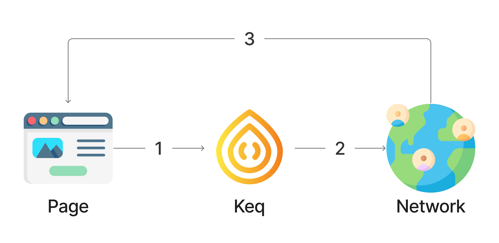
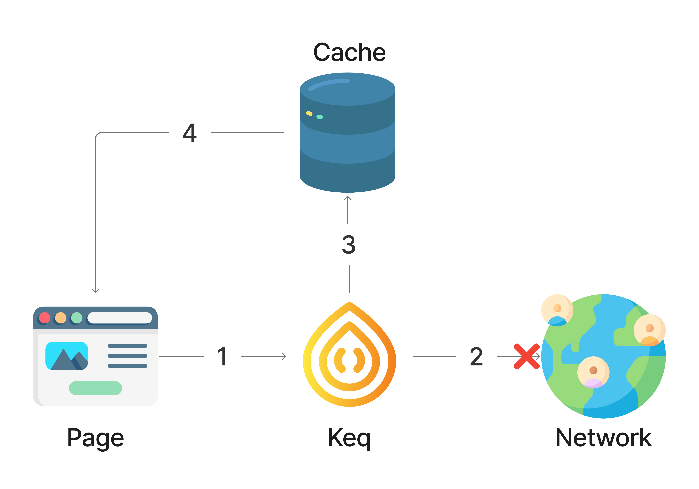
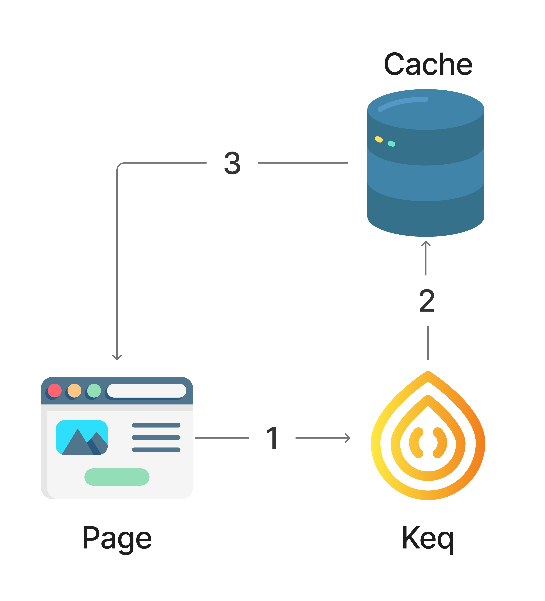
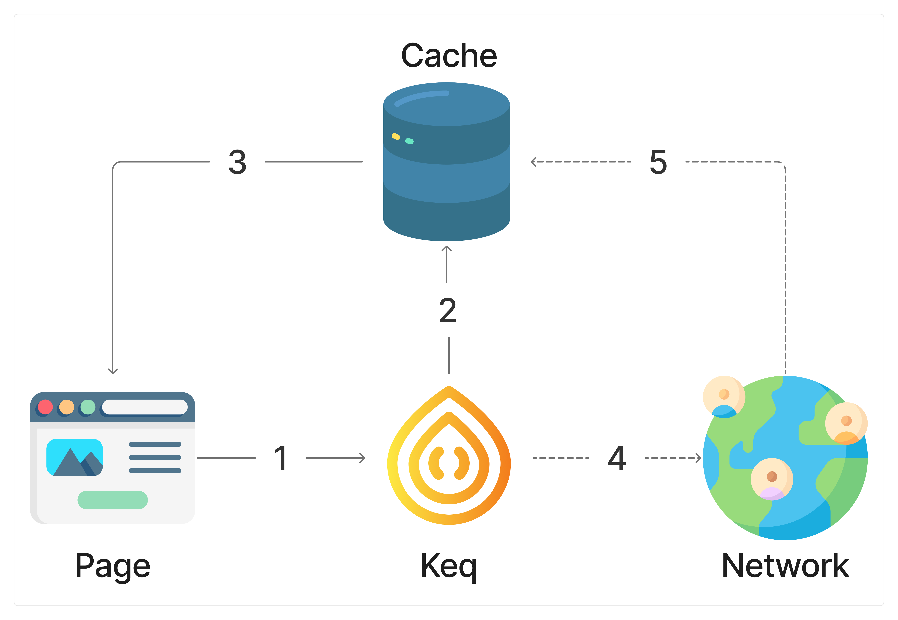

## Strategies

### `Strategies.NETWORK_ONLY`

Send request directly. Don't use cache.

### `Strategies.NETWORK_FIRST`

Try to send the request, if it fails, return the cache.

### `Strategies.CACHE_FIRST`

Return cache if it exists, otherwise send request.

### `Strategies.STALE_WHILE_REVALIDATE`

Return cache if it exists And then send request and update cache asynchronously.
